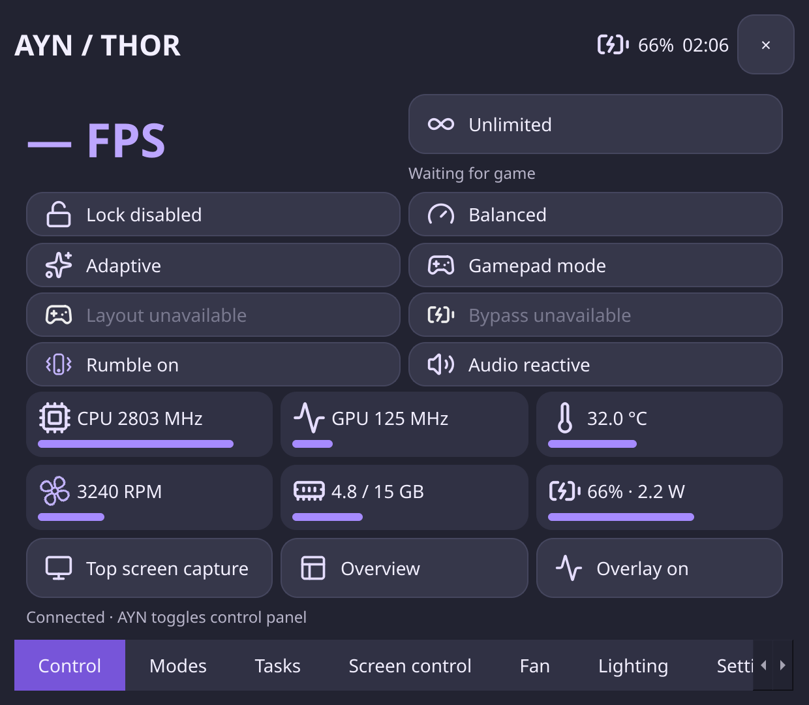

### Intro
**HandheldDash** is a touch-friendly handheld control panel and a system D-Bus hardware daemon for Arch Linux with KDE Plasma/Wayland. It currently supports and has been tested only on **AYN Thor running the Thorch BSP**; support for other handhelds is planned. [中文文档](README.zh-CN.md). 

### Feature

- performance and fan profiles with editable fan curves
- dual-screen brightness and application placement
- task switching, region/top/bottom screenshots, playback volume 
- independent joystick lighting with audio-reactive output and color dials
- configurable Home/Back actions, and gamepad/mouse input profiles. 
 
The daemon lets an active local user operate supported hardware without running the interface as root. [Features and limits](docs/features.md).

### Limitations
Android partition access require custom kernel and is **extremely experimental: it may not work and may even prevent Android from booting**. 

Wider device support is planned; unsupported controller layouts and bypass charging are to be supported by upstream driver. 
### Install

On a compatible Thorch installation, download lateset release from [Releases](https://github.com/lurenjiamax/HandheldDash/releases), 

#### Manual Install
1. Enable SSH, and use scp to transport the release into your device. Or download the package on your handheld device.

2. Install it with `sudo pacman -U <Package>`

3. Run 
```bash
sudo systemctl enable --now inputplumber.service aynthor-hardwared.service 
systemctl --user enable --now aynthor-control.service
```

Press the AYN key to toggle the panel. Or run `handhelddash`, open `handhelddash --settings`, or  [Installation, upgrades and source builds](docs/installation.md).

### License
Original project code is licensed under **LGPL-3.0-or-later**; see [LICENSE](LICENSE) and [COPYING](COPYING). Vendored lpunpack and Lucide icons retain their LGPL and ISC notices; dependencies retain their own licenses, including PyQt6's GPL/commercial terms. 

This is community software without warranty, and hardware support must not be assumed beyond AYN. [Third-party notices](docs/third-party.md).
